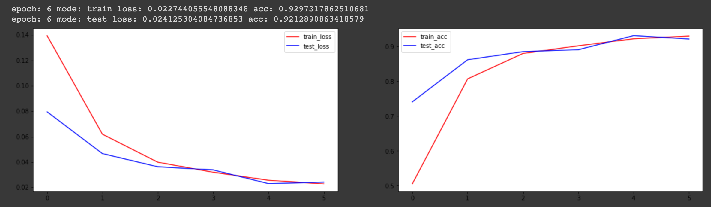

# ViT-vision-transformer-pytorch
Vision Transformer PyTorch [in progress]

Paper:
### An Image is Worth 16x16 Words: Transformers for Image Recognition at Scale

https://paperswithcode.com/paper/an-image-is-worth-16x16-words-transformers

Bare bones simple 2 layer ViT model for MNIST

Results using IS_MEAN_FEATURES_HACK
To avoid hack you could use IS_AUTO_ENCODER_HACK or add more layers of transformer

